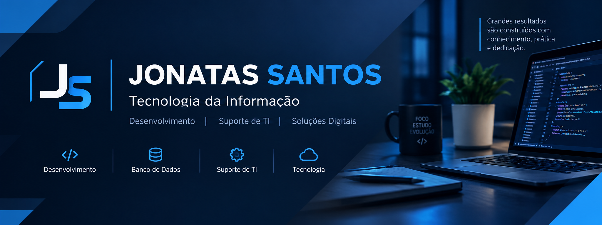

  

# 👋 Olá! Eu sou Jonatas Santos

🎓 **Graduado em Análise e Desenvolvimento de Sistemas**                                                                                                                                                                     
💻 **Em transição de carreira para a área de Tecnologia da Informação**                                                                                                                                                      

Atualmente estou desenvolvendo meus conhecimentos em programação, banco de dados e desenvolvimento web, criando projetos práticos para consolidar minha formação e construir meu portfólio profissional.

## 🚀 Sobre mim

Sou formado em **Análise e Desenvolvimento de Sistemas** e estou em **transição de carreira para a área de Tecnologia da Informação**.

Minha experiência profissional anterior me proporcionou conhecimentos em **organização, controle de processos, resolução de problemas, trabalho em equipe e atendimento**, competências que considero importantes para minha atuação na área de tecnologia.

Durante minha formação e estudos, desenvolvi conhecimentos em **Python, JavaScript, HTML5, CSS3, SQL, Bootstrap, Git e GitHub**, além de utilizar projetos práticos para aprimorar minhas habilidades e construir meu portfólio.

Atualmente, busco minha **primeira oportunidade profissional em TI**, com interesse em áreas como **Analista de TI, Assistente de TI, Suporte de TI e Desenvolvimento Júnior**, além de outras oportunidades relacionadas à tecnologia.

## 🛠️ Tecnologias e Conhecimentos

### 💻 Linguagens de Programação

* Python
* JavaScript

### 🌐 Desenvolvimento Web

* HTML5
* CSS3
* Bootstrap

### 🗄️ Banco de Dados

* SQL

### 🧰 Ferramentas

* Git
* GitHub
* Excel
* Word

## 🎯 Objetivo Profissional

Busco minha primeira oportunidade profissional na área de Tecnologia da Informação, com interesse em atuar como **Analista de TI Júnior, Assistente de TI, Assistente de Suporte de TI, Desenvolvedor Júnior** ou em áreas relacionadas à tecnologia.

Tenho conhecimentos em **programação, bancos de dados, desenvolvimento web e ferramentas de tecnologia**, que venho aprimorando por meio de estudos e projetos práticos.

Busco uma oportunidade que me permita **aplicar meus conhecimentos, adquirir experiência profissional e continuar evoluindo na área de Tecnologia da Informação**.

## 📚 Atualmente estudando

* 🐍 Aprofundamento em Python
* 🗄️ SQL e bancos de dados
* 💻 Desenvolvimento de aplicações
* 🔧 Git e GitHub
* 🖥️ Fundamentos de suporte e infraestrutura de TI
* 🧩 Modelagem de processos (BPM/BPMN)

## 🚀 Projetos em destaque

### 🎮 Jogo Mata-Mosquito

Jogo web desenvolvido para praticar lógica de programação, interação com o usuário e manipulação de elementos da página.

**Tecnologias:** HTML5 • CSS3 • JavaScript

[🔗 Ver projeto](https://jonatasdassantos.github.io/app_mata_mosquito/) | [💻 Código-fonte](https://github.com/jonatasdassantos/app_mata_mosquito)

---

### 💰 Aplicativo Orçamento Pessoal

Aplicação web para controle de despesas, com cadastro, categorias, consulta e exclusão de registros.

**Tecnologias:** HTML5 • CSS3 • JavaScript

[🔗 Ver projeto](https://jonatasdassantos.github.io/app_orcamento_pessoal/) | [💻 Código-fonte](https://github.com/jonatasdassantos/app_orcamento_pessoal)

---

### 🧠 Projeto Quiz

Aplicação web interativa de perguntas e respostas, com múltiplas alternativas, feedback visual e apresentação do resultado.

**Tecnologias:** HTML5 • CSS3 • JavaScript

[🔗 Ver projeto](https://jonatasdassantos.github.io/projeto_quizz/) | [💻 Código-fonte](https://github.com/jonatasdassantos/projeto_quizz)

---

### 🎵 Projeto Spotify

Interface web inspirada no Spotify, com navegação, layout responsivo, efeito Parallax e carrossel.

**Tecnologias:** HTML5 • CSS3 • Bootstrap

[💻 Código-fonte](https://github.com/jonatasdassantos/projeto-inicial-spotify)

---

### 💰 Projeto Finans

Interface web responsiva inspirada em uma plataforma financeira, com navegação, seções de conteúdo e campo para e-mail.

**Tecnologias:** HTML5 • CSS3 • Bootstrap

[💻 Código-fonte](https://github.com/jonatasdassantos/projeto-finans-bootstrap4)

---

### 📱 Projeto Android

Página web sobre Android, com menu de navegação, imagens, textos, links e layout responsivo.

**Tecnologias:** HTML5 • CSS3

[🔗 Ver projeto](https://jonatasdassantos.github.io/projeto-android/) | [💻 Código-fonte](https://github.com/jonatasdassantos/projeto-android)

## 📫 Contato

🔗 **LinkedIn:** [Meu perfil no LinkedIn](https://www.linkedin.com/in/jonatas-da-silva-santos-33653b224/)

📧 **E-mail:** [jhonas192@hotmail.com](mailto:jhonas192@hotmail.com)

---

⭐ Obrigado por visitar meu perfil!
